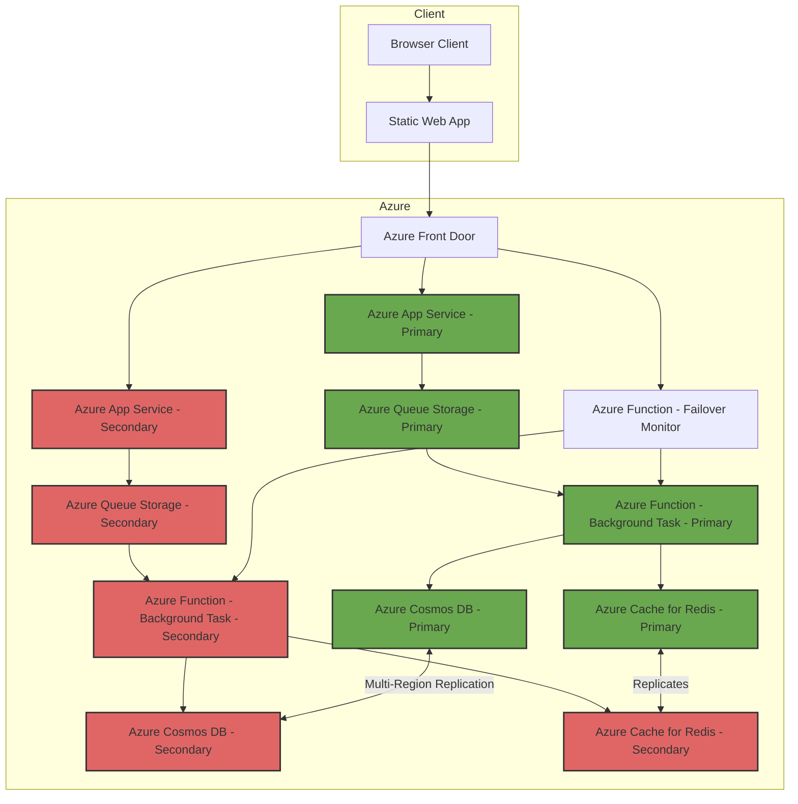

# Two-Region Web Application with Table Storage Failover

This repository contains an implementation of a two-region web application architecture on Azure. The architecture ensures high availability and disaster recovery by utilizing multiple Azure regions, Azure Front Door, Cosmos DB, Azure Queue Storage, Azure Functions, Azure Cache for Redis, and more.

## Overview


The main components of this architecture include:

- **Azure Front Door**: Provides global load balancing and secure, fast, and reliable content delivery with automatic failover.
- **Azure App Service**: Hosts the web application and APIs that interact with Azure Functions and other backend services.
- **Azure Functions**: Executes background tasks and handles failover scenarios.
- **Azure Cosmos DB**: Provides globally distributed, multi-region data storage.
- **Azure Cache for Redis**: Caches data to reduce load on the Cosmos DB and speed up response times.
- **Azure Queue Storage**: Queues tasks for background processing by Azure Functions.
- **Static Web App**: A React-based front-end for managing inventory and monitoring the health of the application.

## Architecture Diagram



- **Azure Cosmos DB Replication**: 
  - The line labeled **`Multi-Region Replication`** between **`G1[Azure Cosmos DB - Primary]`** and **`G2[Azure Cosmos DB - Secondary]`** indicates the native multi-region replication enabled by Azure Cosmos DB.
  
- **Azure Cache for Redis Replication**:
  - The line labeled **`Replicates`** between **`H1[Azure Cache for Redis - Primary]`** and **`H2[Azure Cache for Redis - Secondary]`** represents the custom replication mechanism that uses an Azure Function or another service to replicate data from the primary Redis cache to the secondary.

- **Azure Functions and App Services**: 
  - **`Azure Function - Background Task`** processes tasks from the Azure Queue Storage in both regions and interacts with Cosmos DB and Redis Cache.
  - **`Azure Function - Failover Monitor`** checks the health of the primary region and initiates failover if necessary, interacting with both background task functions.

## How to Use the Services

### 1. **Frontend (Static Web App)**

The frontend is a React-based dashboard for managing inventory and monitoring application health. It interacts with the Azure App Service API to perform CRUD operations on inventory items and checks the health status of the application.

- **Add Inventory Items**: Allows administrators to add new inventory items.
- **View Inventory Items**: Displays the current inventory items.
- **Monitor Health**: Provides a health check of the primary and standby regions.

#### Running the Frontend Locally

To run the React app locally:

1. Install dependencies:

    ```bash
    npm install
    ```

2. Run the app:

    ```bash
    npm start
    ```

3. The app will be available at `http://localhost:3000`.

### 2. **Azure App Service (API)**

The Azure App Service hosts a RESTful API that allows you to manage inventory items. The API has the following endpoints:

- **POST /api/inventory/add-item**: Adds a new inventory item.
- **GET /api/inventory/get-item/{id}**: Retrieves an inventory item by ID.
- **GET /api/health**: Returns the health status of the application.

#### Sending Requests to the API

- **Add an Inventory Item**

    ```bash
    curl -X POST "https://your-api.azurewebsites.net/api/inventory/add-item" -H "Content-Type: application/json" -d '{
        "id": "12345",
        "name": "Sample Item",
        "quantity": 10,
        "location": "Warehouse 1"
    }'
    ```

- **Get an Inventory Item**

    ```bash
    curl -X GET "https://your-api.azurewebsites.net/api/inventory/get-item/12345"
    ```

- **Check Health Status**

    ```bash
    curl -X GET "https://your-api.azurewebsites.net/api/health"
    ```

### 3. **Azure Functions**

Azure Functions perform background tasks and monitor failover scenarios:

- **Background Task Function**: Processes tasks from the Azure Queue Storage and updates Cosmos DB.
- **Failover Function**: Periodically checks the health of the primary region and initiates failover if necessary.

### 4. **Azure Cosmos DB**

Azure Cosmos DB provides a globally distributed, multi-region data store. All inventory data is stored in Cosmos DB, ensuring low latency and high availability across multiple Azure regions.

### Deployment

To deploy the solution, follow these steps:

1. Fork this repository and clone it locally.
2. Set up the required [GitHub Secrets](#github-secrets) in your repository settings.
3. Push changes to the `main` branch to trigger the deployment workflows.

### GitHub Secrets

Ensure you have the following secrets set in your GitHub repository:

- **`AZURE_CREDENTIALS`**: Azure service principal credentials in JSON format.
- **`AZURE_RESOURCE_GROUP`**: The Azure resource group name.
- **`AZURE_LOCATION`**: The primary region for deployment (e.g., `eastus`).
- **`AZURE_LOCATION_SECONDARY`**: The secondary region for deployment (e.g., `westus`).
- **`AZURE_APP_SERVICE_NAME`**: The name of the Azure App Service.
- **`AZURE_APP_SERVICE_PUBLISH_PROFILE`**: Publish profile of the Azure App Service.
- **`AZURE_FUNCTION_APP_NAME_RETRY`**: The name of the Azure Function App handling retry logic.
- **`AZURE_FUNCTION_APP_NAME_FAILOVER`**: The name of the Azure Function App handling failover logic.
- **`AZURE_FUNCTION_APP_PUBLISH_PROFILE_RETRY`**: Publish profile for the retry Azure Function App.
- **`AZURE_FUNCTION_APP_PUBLISH_PROFILE_FAILOVER`**: Publish profile for the failover Azure Function App.

## License

This project is licensed under the MIT License - see the [LICENSE](LICENSE) file for details.

## Contributions

Contributions are welcome! Please see the [contributing guidelines](CONTRIBUTING.md) for more details.
